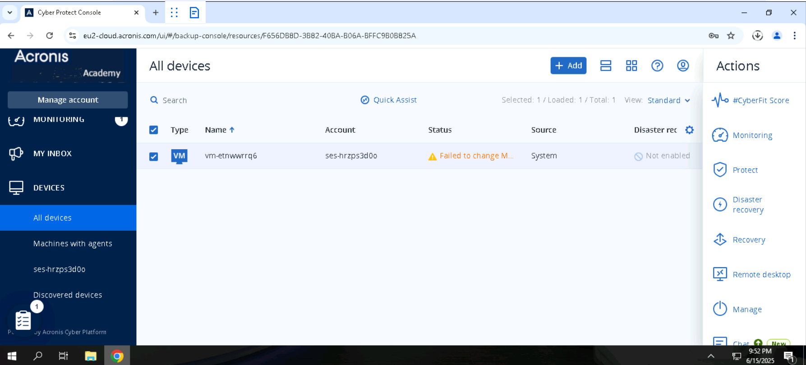

# Performing a file-level recovery

## Instructions

1. Please select _DEVICES_-> _All devices_ in the blue main menu on the left.
2. In the device view select the server device and select _Recovery_ on the right popping up menu.

<figure><figcaption></figcaption></figure>

3. Select the most recent recovery point and click on _Recover > Files/folders_

<figure><figcaption></figcaption></figure>

4. Browse and select _C:\Backupfiles_ folder and click _Recover_ on the right popping up menu.

<figure><figcaption></figcaption></figure>

<figure><figcaption></figcaption></figure>

5. Make sure _Original location_ is selected and click Start Recovery.

<figure><figcaption></figcaption></figure>

6. Select _Overwrite an existing file if it is older_ and click _PROCEED_

<figure><figcaption></figcaption></figure>

<figure><figcaption></figcaption></figure>

