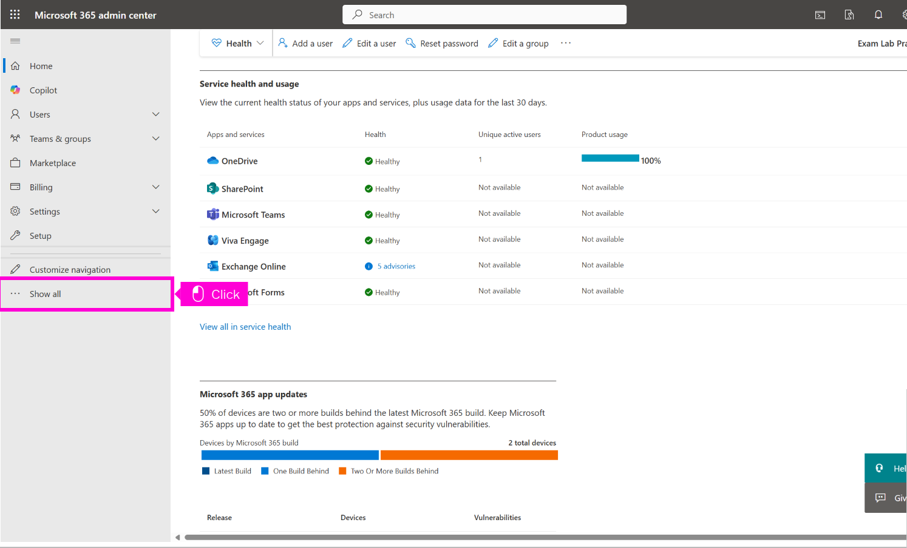

# Use Entra ID protection to set User Risk to Medium


Use Entra ID protection to set User Risk to Medium & Above. Sign In Risk to Low & Above


## Portal.azure.com

<figure><figcaption></figcaption></figure>

Scroll up and click Show portal menu

<figure><figcaption></figcaption></figure>

Scroll and click Security

<figure><figcaption></figcaption></figure>

Click Identity Protection

<figure><figcaption></figcaption></figure>

Click User risk policy

<figure><figcaption></figcaption></figure>

Click Low and above

<figure><figcaption></figcaption></figure>

Click Done

<figure><figcaption></figcaption></figure>

Click highlight

<figure><figcaption></figcaption></figure>

Click Save

<figure><figcaption></figcaption></figure>

Click Sign-in risk policy

<figure><figcaption></figcaption></figure>

Click Medium and above

<figure><figcaption></figcaption></figure>

Click highlight

<figure><figcaption></figcaption></figure>

Click Done

